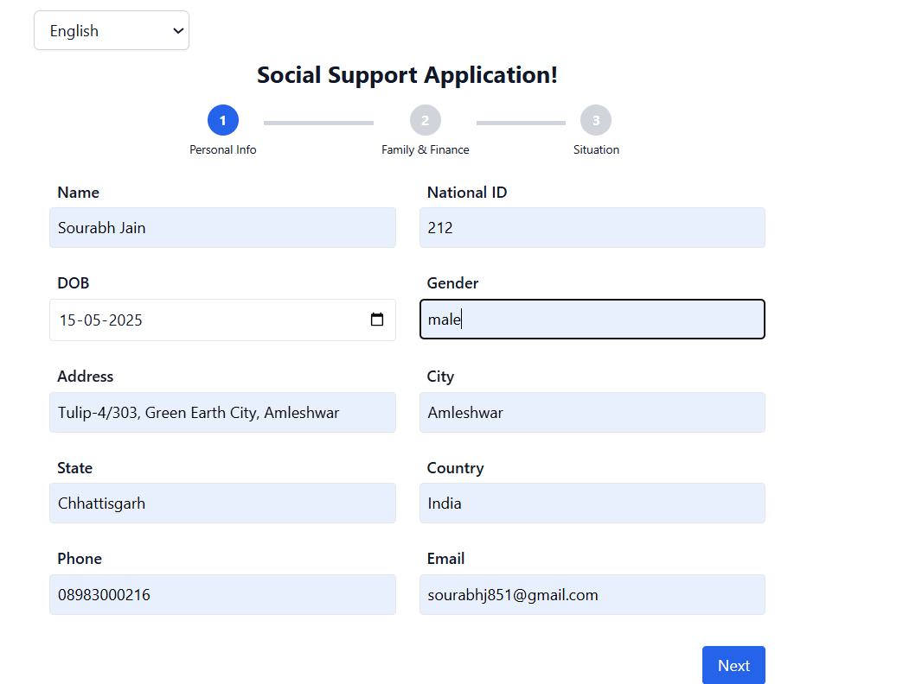
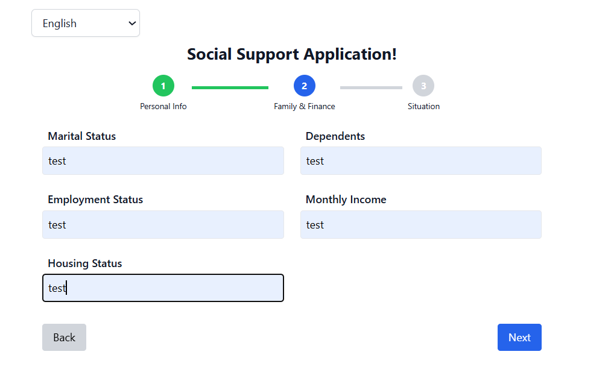
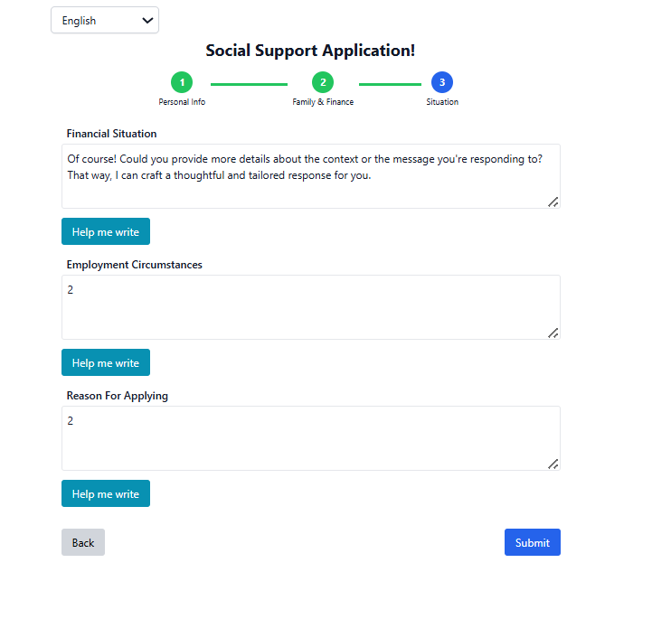

# Getting Started with Social Support Webapp

The Social Support Application is a bilingual (English/Arabic) web form that helps citizens apply for financial aid through a 3-step process. It collects personal, financial, and situational information in a user-friendly, mobile-responsive interface. In the final step, users can use integrated AI (via Open source API) to generate assistance text for describing their financial circumstances. The app supports RTL layout, accessibility standards, and local storage to save progress

## Available Scripts

In the project directory, you can run:

### `npm install`

To install all the project dependecies, before runing npm start.

### `npm start`

Runs the app in the development mode.\
Open [http://localhost:3000] to view it in your browser.

The page will reload when you make changes.\
You may also see any lint errors in the console.

### `npm run test a`

Launches the test runner in the interactive watch mode.\
See the section about [running tests] for more information.

### `npm run coverage a`

Launches the coverage runner for test cases in the interactive watch mode.

### `npm run build`

Builds the app for production to the `build` folder.\
It correctly bundles React in production mode and optimizes the build for the best performance.

The build is minified and the filenames include the hashes.\
Your app is ready to be deployed!

See the section about [deployment] for more information.

### `npm run eject`

**Note: this is a one-way operation. Once you `eject`, you can't go back!**
