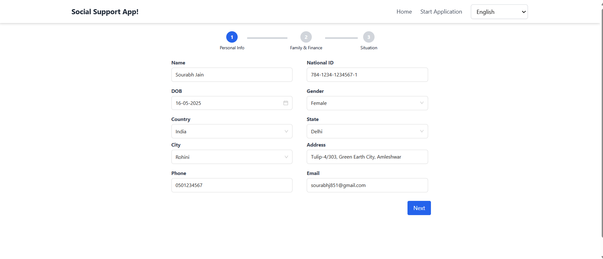

# Getting Started with 
# Multi-Step Social Support Application with AI Assistance

## Available Scripts

In the project directory, you can run:

### `npm install`

To install all the project dependecies, before runing npm start.

### `npm start`

Runs the app in the development mode.\
Open [http://localhost:3000] to view it in your browser.

The page will reload when you make changes.\
You may also see any lint errors in the console.

### `npm run test a`

Launches the test runner in the interactive watch mode.\
See the section about [running tests] for more information.

### `npm run coverage a`

Launches the coverage runner for test cases in the interactive watch mode.

### `npm run build`

Builds the app for production to the `build` folder.\
It correctly bundles React in production mode and optimizes the build for the best performance.

The build is minified and the filenames include the hashes.\
Your app is ready to be deployed!

See the section about [deployment] for more information.

### `npm run eject`

**Note: this is a one-way operation. Once you `eject`, you can't go back!**

## Technology Stack
- **React.js** + **TypeScript** — for building a robust and type-safe UI.
- **Tailwind CSS** — for utility-first, responsive styling.
- **Ant Design** — for pre-built UI components and icons, enabling fast and consistent design.
- **AI Integration** — to provide smart suggestions on the final step.
- **Accessibility** - added accessibility for better usability.

## Features
- **Home Page** — introductory landing page with navigation.
- **Multi-Step Form** — three-step form with smooth navigation using Ant Design's Stepper component.
- **AI Assistance** — AI-powered help on the last step to assist users with suggestions and improve user experience.

## Architecture & Design Decisions
- Modular and reusable components built with React and Ant Design.
- Strong type safety using TypeScript.
- Utility-first styling approach with Tailwind CSS for fast UI development.
- Stepper ensures guided user input, reducing errors.
- AI integration adds value by offering contextual assistance.

## Future Improvements
- Introduce global state management for complex data flows.
- Enhance form validation with real-time feedback.
- Optimize performance by lazy loading AI components.
- Add comprehensive testing for reliability.

## How to Set Up OpenAI API Key

The official OpenAI trial API access is currently unavailable. To ensure uninterrupted AI-powered features, this project uses a custom AI endpoint hosted locally by our AI practice team:
https://ef4b-103-167-195-158.ngrok-free.app/chat 

## Overview
This project is a React-based multi-step form application built with TypeScript, Tailwind CSS, and Ant Design. It features a streamlined user flow with a stepper component guiding users through three sequential pages. On the final step, AI-powered suggestions help users with personalized recommendations if needed.

